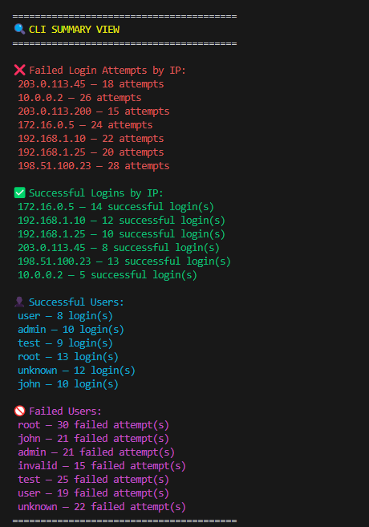
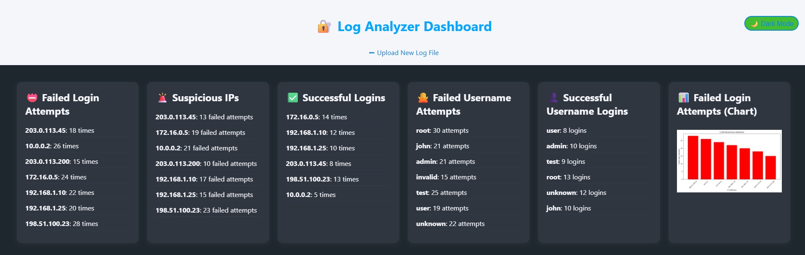

# 🔐 Password & SSH Log Analyzer

A beginner-friendly yet powerful Python-based cybersecurity tool that analyzes SSH authentication logs (`auth.log`) to detect brute-force attempts, failed/successful logins, and visualize attack patterns — with a web dashboard!

---

## 📂 Features

✅ Analyze `auth.log` for:

- Failed login attempts per IP
- Successful logins per IP
- Usernames involved in attacks
- Timestamps of login events
- Brute-force behavior detection

✅ CLI Summary View:

- Colored real-time summary in terminal using `colorama`
- Sorted IPs, user activity, and login statistics

✅ 🌐 Web Dashboard (Flask + Chart.js + Custom CSS):

- **Drag-and-drop log file uploader** for a seamless experience
- Beautiful **dark-themed dashboard** UI with clear visual hierarchy
- Live charts:
  - Failed login attempts per IP
  - Successful logins per user/IP
- Tables summarizing:
  - Failed & successful login counts
  - Users targeted or successfully authenticated
  - Login time history per IP
- Responsive and clean cyber-themed design

---

## 📷 Screenshots

| CLI Summary | Web Dashboard |
|-------------|----------------|
|  |  |

---

## 🚀 How to Run

### 1. Clone the Repo

git clone https://github.com/sayf20/password-analyzer.git
cd password-analyzer

### 2. Create a Virtual Environment

python -m venv venv
venv\Scripts\activate   # on Windows

### 3. Install Requirements

pip install -r requirements.txt

### 4. Run CLI Analyzer

python analyzer.py

### 5. Launch the Web Dashboard

python app.py
# Visit http://127.0.0.1:5000 in your browser

## 📁 File Structure

password-analyzer/
│
├── analyzer.py              # Original CLI-based log analyzer
├── analyzer_utils.py        # Utility module used in the web version
├── app.py                   # Flask web server
├── logs/
│   └── auth.log             # Uploaded logs are stored here
├── templates/
│   ├── upload.html          # Upload page with drag-and-drop interface
│   └── dashboard.html       # Interactive dashboard
├── static/
│   └── styles.css           # Custom CSS (dark theme, responsive UI)
├── screenshots/
│   ├── cli.png
│   └── dashboard.png
├── report.txt               # Text summary of the analysis
├── failed_attempts_chart.png  # Chart generated by CLI version
├── requirements.txt
└── README.md

## 🧠 What I Learned

Log parsing & analysis using Python

Real-world Linux security data (auth.log)

Flask routing, file uploads, and templates

Chart.js for interactive data visualization

Advanced HTML/CSS (drag-and-drop, dark mode, responsive design)

GitHub documentation best practices

## 💡 Future Ideas

GeoIP lookup for attacker origin

Email alerts for suspicious activity

Admin panel with authentication

Export reports as PDF or CSV

Multi-file log uploads with session history

## 👨‍💻 Author
Saifeddine  — cybersecurity enthusiast building real skills 🔥